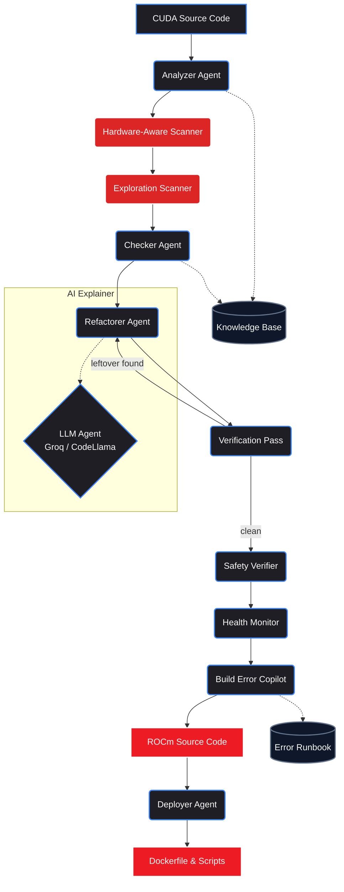

<div align="center">
  
  
  # ROCm Forge
  **The multi-agent migration engine bridging the gap between NVIDIA CUDA and AMD ROCm.**
  
  [](https://www.amd.com/en/developer.html)
  [](https://fastapi.tiangolo.com/)
  [](https://rocm.docs.amd.com/)
  [](https://huggingface.co/codellama)
  <br />
  [](https://rocm-forge.onrender.com)
</div>

<br />

## ⚡ The Problem: The CUDA Moat
The biggest bottleneck to adopting high-performance AMD GPUs (like the MI300X) isn't the hardware—it's the massive ecosystem of legacy AI workloads hardcoded to the NVIDIA CUDA API. Manually migrating these codebases to AMD's ROCm is tedious, undocumented, and error-prone.

## 🚀 The Solution: ROCm Forge
**ROCm Forge** is an explainable, deterministic multi-agent AI copilot designed to automatically convert NVIDIA CUDA codebases to run natively on AMD ROCm.

By combining **Deterministic AST Parsing** for reliable core API mapping, **LLM Agents** for contextual edge-case analysis, and a **custom LoRA-tuned CodeLlama model trained on AMD GPUs**, ROCm Forge guarantees that your migration is not a black box.

**We reduce manual migration effort by an estimated 65%.**

---

## 🧠 Core Architecture



### 9-Agent Pipeline

1. **Analyzer Agent** — Detects code type (Python/PyTorch, C++ Kernel, Dockerfile) and extracts CUDA APIs.
2. **Hardware-Aware Scanner** — Detects architecture-level issues: warp → wavefront mismatches, Tensor Core → MFMA intrinsic lowering, PTX assembly.
3. **Exploration Scanner** — Curiosity-driven scan for *implicit* CUDA assumptions (hardcoded `32`, SM counts, L2 cache hints) that regex alone misses.
4. **Checker Agent** — Maps NVIDIA APIs to `hip` / `MIOpen` equivalents using an internal knowledge base.
5. **Refactorer Agent** — Deterministic transforms with hardware-aware second pass. Confidence Scores (`Safe`, `Review`, `Manual`).
6. **Verification Pass** — Re-scans migrated code for leftover CUDA artifacts. Triggers rescue branches if residue found.
7. **Health Monitor** — Calculates per-line saliency map and migration health score. Detects "diagnostic drift" — areas likely to cause silent failures on AMD.
8. **Build Error Copilot** — Pre-emptively matches code patterns against a runbook of common ROCm build failures and suggests fixes before you hit the error.
9. **LLM Explainer Agent** — Two modes:
   - **Cloud Mode:** Groq API (Llama 3.1) for instant analysis.
   - **Enterprise Mode:** Custom LoRA fine-tuned CodeLlama, trained on AMD MI300X GPUs.

---

## 🔥 Fine-Tuning on AMD GPUs (ROCm)

ROCm Forge includes a complete fine-tuning pipeline designed to run natively on **AMD Instinct MI300X** GPUs using ROCm.

### Dataset
We built a curated dataset of **20+ paired CUDA→ROCm migration examples** covering:
- PyTorch training loops & AMP
- vLLM inference configuration
- Custom CUDA C++ kernels → HIP
- Dockerfiles & environment variables
- DeepSpeed, FSDP, Flash Attention
- Triton kernels (AMD wavefront tuning)
- TensorRT → MIGraphX
- NVIDIA CLI tools → ROCm equivalents

### Training Script
```bash
# On AMD Developer Cloud (MI300X instance)
cd rocm-forge

# 1. Install ROCm PyTorch
pip install torch torchvision torchaudio --index-url https://download.pytorch.org/whl/rocm6.2

# 2. Install training dependencies
pip install -r training/requirements.txt

# 3. Fine-tune CodeLlama-7B with QLoRA on AMD GPU
python training/train_rocm.py

# 4. Test the fine-tuned model
python training/train_rocm.py --test
```

### Training Configuration
| Parameter | Value |
|-----------|-------|
| Base Model | `codellama/CodeLlama-7b-hf` |
| Method | QLoRA (4-bit NF4) |
| LoRA Rank | 16 |
| LoRA Alpha | 32 |
| Target Modules | `q_proj`, `k_proj`, `v_proj`, `o_proj` |
| Epochs | 3 |
| Learning Rate | 2e-4 |
| Scheduler | Cosine |
| Precision | FP16 |
| GPU | AMD Instinct MI300X (ROCm 6.2) |

---

## 🛠️ Tech Stack
| Component | Technology |
|-----------|-----------|
| Backend | FastAPI (Python) |
| Frontend | Vue.js + Tailwind CSS |
| AI Inference | Groq API (Llama 3.1 70B) |
| Fine-Tuning | QLoRA / PEFT on CodeLlama-7B |
| GPU Target | AMD Instinct MI300X (ROCm 6.2) |
| Parsing | Python `ast` + Regex static analysis |
| Deployment | Docker |

---

## ⚙️ Quick Start (Web UI)

```bash
# 1. Clone the repository
git clone https://github.com/vivekrajsingh04/rocm-forge.git
cd rocm-forge

# 2. Install dependencies
pip install -r requirements.txt

# 3. Start the FastAPI server
python3 api.py
```

Open **http://localhost:8000** in your browser.

---

## 🐳 Docker Deployment

```bash
docker build -t rocm-forge .
docker run -p 8000:8000 rocm-forge
```

---

## 📊 Why This Wins

| Criteria | How ROCm Forge Delivers |
|----------|------------------------|
| **Technical Depth** | Hardware-aware analysis (Warp→Wavefront, TensorCore→MFMA), not just string replacement |
| **AMD GPU Usage** | Fine-tuned CodeLlama on MI300X via ROCm |
| **Business Value** | Saves engineering hours; 65% effort reduction |
| **Explainability** | Per-line saliency maps, migration health scores, confidence labels |
| **Verification** | Multi-pass rescue branches + build error copilot with runbook database |
| **Deployment** | Auto-generates Dockerfiles & scripts for AMD Cloud |

---

## 📁 Project Structure
```
rocm-forge/
├── api.py                    # FastAPI backend
├── Dockerfile                # Production container
├── requirements.txt          # App dependencies
├── static/
│   └── index.html            # Vue.js + Tailwind UI
├── agents/
│   ├── analyzer.py           # Code type detection & pattern extraction
│   ├── orchestrator.py       # Pipeline coordination
│   ├── refactorer.py         # Deterministic AST transformations
│   ├── deployer.py           # Deployment artifact generation
│   └── llm_agent.py          # LLM analysis (Groq / fine-tuned)
├── knowledge/
│   ├── cuda_mappings.py      # CUDA → ROCm API mapping table
│   └── templates.py          # Deployment templates
├── training/
│   ├── dataset.jsonl         # CUDA→ROCm paired training data
│   ├── train_rocm.py         # QLoRA fine-tuning script (AMD GPU)
│   └── requirements.txt      # Training dependencies
└── samples/
    └── sample_codes.py       # Demo code snippets
```

<div align="center">
  <br />
  <i>Built with dedication for the AMD Developer Hackathon 2026.</i>
  <br />
  <b>Team Cipher</b>
</div>
