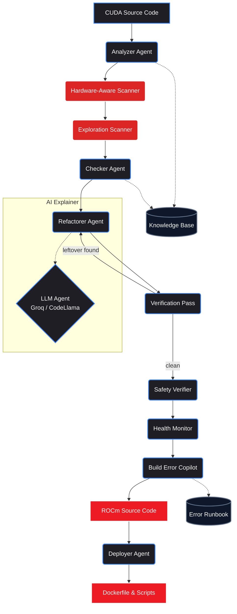

<div align="center">

# ⚡ ROCm Forge

**A multi-agent migration engine that translates NVIDIA CUDA codebases to AMD ROCm — deterministically, explainably, and at scale.**

[](https://rocm-forge.onrender.com)
[](https://fastapi.tiangolo.com/)
[](https://rocm.docs.amd.com/)
[](https://huggingface.co/codellama)

</div>

## The Problem: The CUDA Moat

The biggest bottleneck to adopting high-performance AMD GPUs (like the MI300X) isn't the hardware — it's the massive ecosystem of legacy AI workloads hardcoded to the NVIDIA CUDA API. Manually migrating these codebases to AMD's ROCm is tedious, under-documented, and error-prone.

## The Solution

**ROCm Forge** is an explainable, deterministic multi-agent copilot that converts CUDA code to run natively on ROCm. It combines:

- **Deterministic AST parsing** for reliable core API mapping — real syntax-tree traversal, not regex string replacement
- **LLM agents** for contextual edge-case analysis and per-line explanations
- **A custom LoRA-tuned CodeLlama-7B**, fine-tuned on AMD MI300X GPUs

Every transform carries a confidence label (`Safe` / `Review` / `Manual`), so the migration is never a black box. Estimated manual-effort reduction: **~65%**.

## Quick Start

```bash
git clone https://github.com/vivekrajsingh04/rocm-forge.git
cd rocm-forge
pip install -r requirements.txt
python3 api.py
```

Open **http://localhost:8000**, paste CUDA code (Python/PyTorch, C++ kernels, or Dockerfiles), and get migrated ROCm code with a per-line health report.

**Docker:**

```bash
docker build -t rocm-forge .
docker run -p 7860:7860 rocm-forge
```

## Architecture



### The 9-Agent Pipeline

1. **Analyzer Agent** — Detects code type (Python/PyTorch, C++ kernel, Dockerfile) and extracts CUDA APIs via AST-level analysis
2. **Hardware-Aware Scanner** — Catches architecture-level issues: warp → wavefront mismatches, Tensor Core → MFMA intrinsic lowering, inline PTX
3. **Exploration Scanner** — Curiosity-driven scan for *implicit* CUDA assumptions (hardcoded `32`, SM counts, L2 cache hints) that pattern matching misses
4. **Checker Agent** — Maps NVIDIA APIs to `hip` / `MIOpen` equivalents using an internal knowledge base
5. **Refactorer Agent** — Deterministic transforms with a hardware-aware second pass and confidence scores
6. **Verification Pass** — Re-scans migrated code for leftover CUDA artifacts; triggers rescue branches if residue is found
7. **Health Monitor** — Per-line saliency map + migration health score; flags "diagnostic drift" likely to cause silent failures on AMD
8. **Build Error Copilot** — Pre-emptively matches code against a runbook of common ROCm build failures and suggests fixes
9. **LLM Explainer Agent** — Cloud mode (Groq / Llama 3.1) for instant analysis, or Enterprise mode (LoRA fine-tuned CodeLlama on MI300X)

## Fine-Tuning on AMD GPUs

The repo includes a complete QLoRA fine-tuning pipeline that runs natively on **AMD Instinct MI300X** via ROCm, over a curated dataset of paired CUDA→ROCm migrations (PyTorch/AMP training loops, vLLM configs, HIP kernels, Dockerfiles, DeepSpeed/FSDP, Triton wavefront tuning, TensorRT→MIGraphX).

```bash
pip install torch torchvision torchaudio --index-url https://download.pytorch.org/whl/rocm6.2
pip install -r training/requirements.txt
python training/train_rocm.py          # fine-tune
python training/train_rocm.py --test   # evaluate
```

| Parameter | Value |
|-----------|-------|
| Base model | `codellama/CodeLlama-7b-hf` |
| Method | QLoRA (4-bit NF4), rank 16, α 32 |
| Target modules | `q_proj` `k_proj` `v_proj` `o_proj` |
| Schedule | 3 epochs · LR 2e-4 · cosine · FP16 |
| Hardware | AMD Instinct MI300X (ROCm 6.2) |

## Project Structure

```
rocm-forge/
├── api.py                 # FastAPI backend
├── static/index.html      # Vue.js + Tailwind UI
├── agents/                # 9-agent pipeline (analyzer, refactorer, orchestrator, …)
├── knowledge/             # CUDA → ROCm mapping tables & deploy templates
├── training/              # QLoRA fine-tuning (dataset.jsonl, train_rocm.py)
├── benchmark/             # Migration benchmark harness + results
├── samples/               # Demo CUDA snippets
└── Dockerfile             # Production container
```

## Tech Stack

FastAPI · Vue.js + Tailwind CSS · Groq API (Llama 3.1) · QLoRA/PEFT on CodeLlama-7B · Python `ast` static analysis · Docker

---

<div align="center"><i>Originally built for the AMD Developer Hackathon 2026 — Team Cipher.</i></div>
